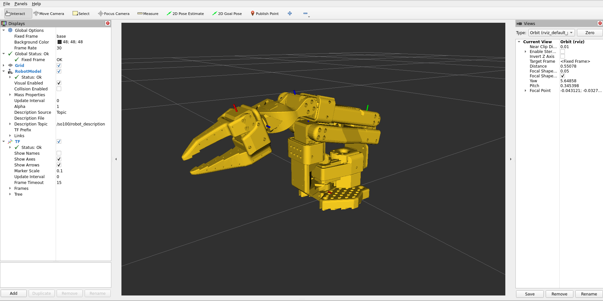

# SO100 Description Package

This package contains the URDF description, mesh files, and launch configurations for the SO100 robot arm.

## Package Contents

- **URDF**: Robot description files (`urdf/so100_arm.urdf`)
- **Meshes**: STL mesh files for robot components
- **Launch**: Launch files for visualization and simulation
- **RViz**: Pre-configured RViz configuration files

## Usage

### Visualize the Robot Model

To launch the robot visualization with RViz and joint state publisher GUI:

```bash
ros2 launch so100_description display.yaml
```

This launch file will:

- Start the `robot_state_publisher` node to publish the robot's state
- Launch `joint_state_publisher_gui` for interactive joint control
- Open RViz2 with a pre-configured visualization setup

#### Visualization

The following shows the SO100 arm visualized in RViz:



<video width="600" controls>
  <source src="media/rviz_demo.mp4" type="video/mp4">
  Your browser does not support the video tag.
</video>

### Using the Robot Description

The URDF file can be used in other packages by including it:

```xml
<param name="robot_description"
       command="$(find xacro)/xacro $(find so100_description)/urdf/so100_arm.urdf"/>
```

## Dependencies

- `urdf`
- `xacro`
- `robot_state_publisher`
- `joint_state_publisher_gui`
- `rviz2`

## Build

This package is built as part of your ROS 2 workspace:

```bash
cd /path/to/your/workspace
colcon build --packages-select so100_description
source install/setup.bash
```
